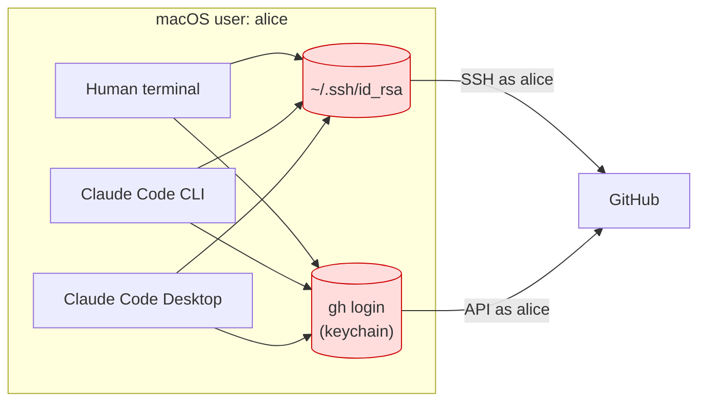
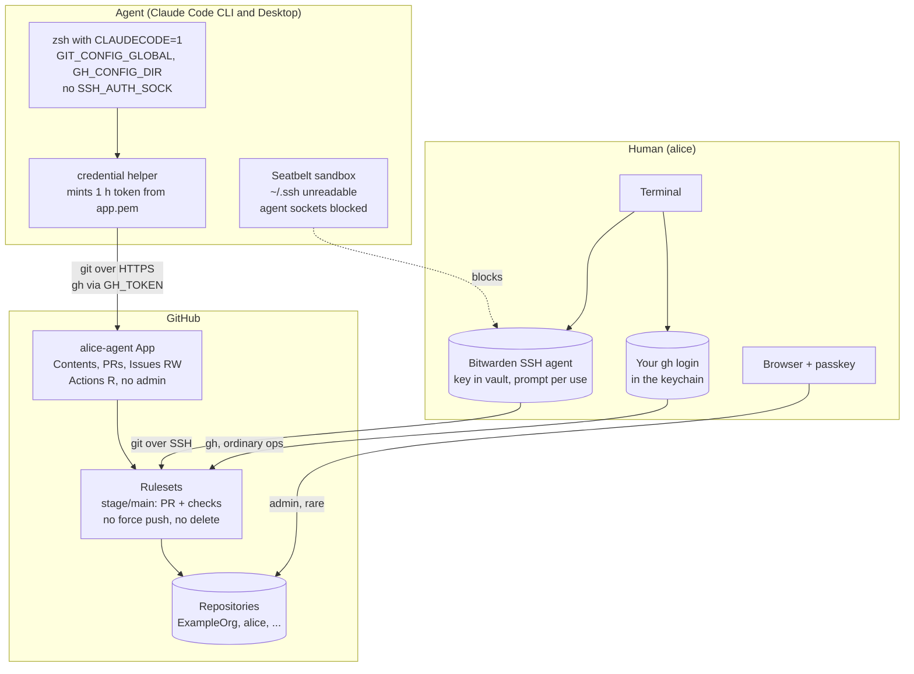
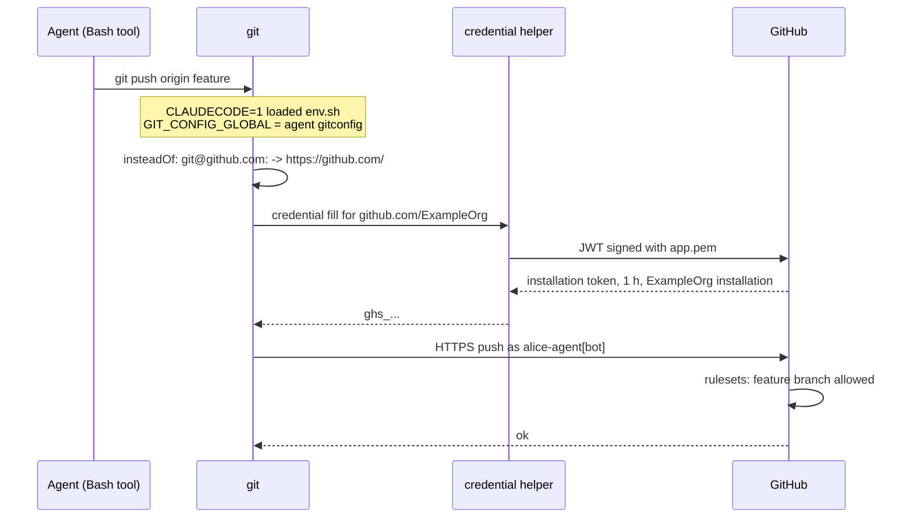

# Agent GitHub access

Give a local coding agent its own least-privilege GitHub identity. Your
own git and `gh` keep working as before. Claude Code (CLI and Desktop)
on macOS is the worked example.

## Getting started

You need:

- macOS, with zsh or bash as your login shell.
- git 2.32 or newer, and the `gh` CLI on your `PATH`.
- Go, to install the credential helper, or its release binary.
- A password manager with an SSH agent, for [step 03](03-ssh-key-to-password-manager.md).
- Owner rights on each GitHub org you want the agent in, or an owner
  who will approve the App.

Then:

1. Clone this repo and `cd` into it. The installer runs from the repo
   root.
2. Do [step 01](01-github.md) in the browser. You end with an App ID
   and the App's private key at `~/.config/agent-git/app.pem`.
3. Run the installer, as [step 02](02-agent-identity.md#run-the-installer)
   describes:

   ```bash
   ./install.sh --app-id <APP_ID> --default-owner <OWNER>
   ```

4. Run step 02's checks in an agent session, then do
   [step 03](03-ssh-key-to-password-manager.md) and
   [step 04](04-claude-code-sandbox.md).
5. Run `./install.sh --check` at any time to see where you stand.

The rest of this page explains the model and why it is built this way.

## The problem

One macOS user, two actors. The agent runs as that user, so by default
it can use every credential the human has: the `~/.ssh/id_rsa` file for
git over SSH, and the `gh` login for the GitHub API. GitHub cannot tell
the two actors apart. Branch protection, audit logs and PR approval
rules all treat the agent as the human.



Goal: the agent keeps normal engineering capability. It can clone,
fetch, push feature branches, open and update PRs, and read CI. It
cannot administer repositories, change rulesets, manage secrets or
collaborators, or act as the human. The human's workflow stays as it is.

The security principle: **GitHub itself must not grant the agent's
identity the dangerous operations.** Local policy that tells the agent
not to misuse a powerful credential is defence in depth, not the
boundary.

## The model



Two identities, two credential stores, one set of server-side rules.

| | Human | Agent |
|---|---|---|
| GitHub identity | `alice` | `alice-agent` App (`alice-agent[bot]`) |
| git transport | SSH, key served by Bitwarden | HTTPS, token from the App |
| `gh` | your own login in the keychain, optionally a restricted PAT | App installation token |
| Admin operations | browser with passkey | none, the App lacks the permissions |
| Can reach the other's credential | n/a | no: key not on disk, `~/.ssh` and agent sockets denied |

## Why this model

### Security

- **Server-enforced least privilege.** The App has no Administration,
  Secrets, Webhooks, Workflows or Environments permission. An admin call
  from the agent fails with 403 at GitHub, whatever the local setup.
  Repo creation fails with 403.
- **Distinct identity, per operator.** Pushes and PRs are recorded as
  `alice-agent[bot]`. Each org member who runs an agent registers
  `<handle>-agent`, so the org can tell whose agent did what. Rulesets
  can treat the App differently from you. The audit log separates the
  two. You can approve the agent's PRs because you are not their author.
- **Commits stay yours.** git takes authorship from `user.email`, not
  from the transport. The agent's commits keep your name and your GPG
  signature.
- **Nothing to fall back to.** The human key leaves the filesystem for
  the password manager's vault. The sandbox denies reads of `~/.ssh` and
  blocks agent sockets. The only GitHub credential the agent can reach
  is `app.pem`, which grants exactly the App's permissions.
- **Short-lived tokens.** Tokens last one hour. The helper mints a
  fresh one for every call, so nobody renews anything.
- **Protected refs regardless of identity.** Rulesets on `stage`,
  `main` and release tags hold even if a future mistake lets the agent
  act as you.

### Operational

- **Human workflow unchanged.** Same remotes, same SSH key through the
  password manager, one `SSH_AUTH_SOCK` line. Your own `gh` login stays as it is,
  unless you choose to restrict it. Bitwarden prompts once per signature.
- **Agent workflow unchanged.** `git fetch`, `git push origin
  feature`, `gh pr create` and `gh run view` all work as before. The
  transport changes underneath.
- **One mechanism for CLI and Desktop.** Both run zsh with
  `CLAUDECODE=1`. Both read `~/.claude/settings.json`. No launcher, no
  wrapper, no Desktop special case.
- **Multi-org by construction.** One App registration, one installation
  per owner with its own repository selection, one config section per
  owner. Adding an org takes ten minutes.

## How an agent git push works after setup



`gh` follows the same path. A shim asks git's credential chain for a
token for the current repo's owner and exports it as `GH_TOKEN`. One
token source.

## The steps

| # | Step | What it does | Why it is needed | Required | Time |
|---|---|---|---|---|---|
| 01 | [01-github.md](01-github.md) | Registers `alice-agent`, installs it on each owner, adds rulesets. Optionally restricts your own `gh` login | Creates the agent's identity and protects the refs that matter | yes (rulesets recommended) | 30 min + 10 min per repo |
| 02 | [02-agent-identity.md](02-agent-identity.md) | Runs [`install.sh`](install.sh): preflight, a plan you confirm, then the agent gitconfig, env file and `gh` shim, verified per owner | Makes the App the default path for the agent on both surfaces | yes | 10 min |
| 03 | [03-ssh-key-to-password-manager.md](03-ssh-key-to-password-manager.md) | Backs up `~/.ssh`, imports the key into Bitwarden, enables its SSH agent, deletes the key file | Removes the credential the agent could fall back to | recommended | 30 min + migration |
| 04 | [04-claude-code-sandbox.md](04-claude-code-sandbox.md) | `sandbox.enabled`, `denyRead` on `~/.ssh`, deny rules in `~/.claude/settings.json` | OS-level enforcement: the agent's processes cannot read `~/.ssh` or open agent sockets | recommended | 10 min |

Order matters. Finish and check [01](01-github.md) and [02](02-agent-identity.md) before [03](03-ssh-key-to-password-manager.md) and [04](04-claude-code-sandbox.md), so the
agent has working HTTPS access before the SSH key moves. Each step ends
with its own checks.

Roll back in reverse step order. Each step ends with its rollback.

## Other agents (Codex CLI and Desktop, others)

Not done here. These are notes for whoever extends this. The design
splits into an agent-agnostic half and an agent-specific half.

Agent-agnostic, reusable as is: the GitHub App, installations and
rulesets (01); the gitconfig, credential helper, HTTPS rewrite and `gh`
shim (02); the password-manager SSH agent (03). None of these know which
agent runs. They only need the agent's shell to load the env file:
`GIT_CONFIG_GLOBAL`, `GH_CONFIG_DIR`, the `PATH` prefix and no
`SSH_AUTH_SOCK`.

Agent-specific, needs investigation per agent:

| Concern | Claude Code (this guide) | To check for Codex and others |
|---|---|---|
| How the shell knows it is an agent shell | `CLAUDECODE=1` set by CLI and Desktop; the source lines test it | Which env var, if any, the other agent sets, and whether its shell reads `~/.zshenv` and `~/.zprofile`. If none, add a second marker to the source lines, or launch the agent through a wrapper that sets one |
| OS-level file read denial | `sandbox.filesystem.denyRead` in `~/.claude/settings.json`, Seatbelt | Codex CLI has its own Seatbelt sandbox (`~/.codex/config.toml`, `sandbox_mode`). Check whether it can deny reads of `~/.ssh`, not only confine writes, and whether the desktop app honours it |
| Tool-level read denial | `permissions.deny` `Read(~/.ssh/**)` | The equivalent in the other agent's config, if one exists |
| Network allowlist and unix sockets | `sandbox.network` | Codex defaults to network off inside its sandbox. Check how that interacts with the credential helper reaching `api.github.com` |

Rule of thumb: keep steps [01](01-github.md) to [03](03-ssh-key-to-password-manager.md) shared across agents. Give each agent
its own version of [step 04](04-claude-code-sandbox.md) and its own marker in the [source line](02-agent-identity.md#why-two-startup-files).

## On Linux

Not walked through. The table maps each macOS mechanism to its Linux
counterpart.

| Concern | macOS (this guide) | Linux |
|---|---|---|
| Agent surfaces | Claude Code CLI and Desktop | CLI only; Claude Desktop does not ship for Linux |
| Installer and shell | `install.sh` supports zsh and bash login shells | The installer and the `gh` shim are bash 3.2 and the env file is POSIX, so both shells work. The installer refuses Linux for now: it reads file modes with macOS `stat -f` and settings with `plutil` |
| Sandbox | Seatbelt, built in | bubblewrap + socat; install them first. Same settings keys |
| Password-manager agent | Bitwarden or 1Password sockets as in [03](03-ssh-key-to-password-manager.md) | Socket paths differ by package (deb, snap, flatpak); check the vendor docs. 1Password: `~/.1password/agent.sock`. No Secretive; gnome-keyring or KeePassXC agents also work |
| Break-glass backup | `hdiutil` encrypted image | LUKS image, or `tar -C ~ -c .ssh \| gpg -c > breakglass-ssh.tar.gpg` |
| Clipboard | `pbcopy` | `wl-copy` or `xclip` |
| Keychain | login keychain via `security` | Secret Service (libsecret); the `helper =` reset already clears it for git |
| Home | `/Users/alice` | `/home/alice` |
| Stronger isolation | a separate macOS user is awkward | a separate Linux user or rootless container is cheap |

Steps [01](01-github.md) and [02](02-agent-identity.md) apart from the shell lines are unchanged.

## Paths

- `OWNER` means a GitHub org or user that owns repos (`ExampleOrg`,
  `alice`).
- Agent-only files live under `~/.config/agent-git/` and
  `~/.config/agent-gh/`. [Step 01](01-github.md#private-key) puts the
  App private key at `~/.config/agent-git/app.pem`. The installer
  writes the rest; [step 02](02-agent-identity.md#what-it-writes) lists
  each file. Outside those directories it adds one source line to two
  startup files and touches nothing else of yours.
- [`files/`](files/) holds the `gh` shim and the Claude Code settings
  fragment for [step 04](04-claude-code-sandbox.md#settings).
- Commands work in zsh and bash. No `sudo`.
